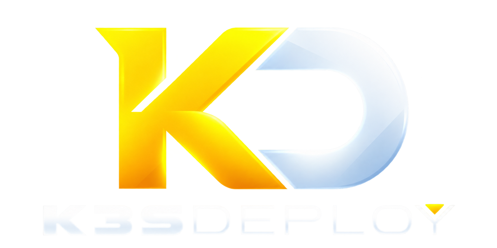
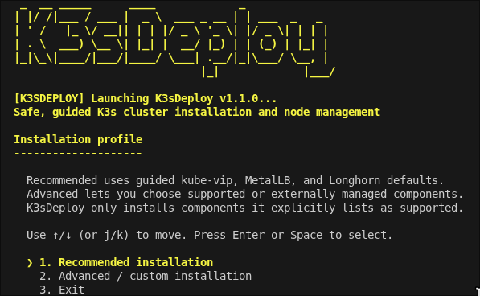

# K3sDeploy

<p align="center">
  
</p>

## Build and recover a K3s cluster with guided choices

K3sDeploy is an interactive installer for building and maintaining small to big highly available K3s clusters. It is designed for beginners who want clear explanations, visible safety checks and sensible defaults without having to memorize every Kubernetes command.

The recommended profile installs a highly available Kubernetes API with
kube-vip, application addresses with MetalLB, ingress with Traefik, and
replicated persistent storage with Longhorn. The advanced profile can use K3s
ServiceLB, shared NFS, local-path storage, or externally managed components.

K3sDeploy can create the first manager, join more managers or workers, promote
a worker, validate a cluster, repair safe local differences, and guide guarded
embedded-etcd recovery. After the control plane is ready, it can also install
the pinned Argo CD HA deployment GUI. It installs one node at a time, so you
stay in control of every machine and every destructive storage decision.

## How to Launch K3sDeploy - Recommended

<p align="center">
  
</p>

On each node, run:

```bash
bash <(curl -fsSL https://cyberpoe.uk/k3sdeploy-latest)
```

The launcher finds and downloads the newest stable version tag to a temporary
directory and then opens the interactive menu. If Git
is missing, the user will get a quick explanation as in why Git is needed. The user is then asked if accepts to download and install Git.

The temporary files are removed when K3sDeploy closes. Run the same command on
the next node and select the appropriate join option:


### Alternative: clone the repository

Clone the repository if you want to inspect the complete project, keep a local
copy, or run its tests:

```bash
sudo apt-get update
sudo apt-get install -y git curl
git clone https://github.com/cyberpoe-uk/K3sDeploy.git
cd K3sDeploy
./k3s-bootstrap.sh
```

For a production deployment, use the same reviewed release tag on every node:

```bash
git clone --branch v1.1.0 --depth 1 https://github.com/cyberpoe-uk/K3sDeploy.git
cd K3sDeploy
./k3s-bootstrap.sh
```

Downloading only `k3s-bootstrap.sh` will not work because K3sDeploy is a
multi-file project.

## Prepare every node first

Start every new cluster node from a fresh Ubuntu Server 24.04 LTS installation.
Do not deploy onto a desktop, a general-purpose server, or a machine containing
an old K3s installation or Longhorn data. K3sDeploy detects existing state and
blocks fresh create or join operations to protect it.

After a node has joined the cluster, you can run K3sDeploy again on that node
for validation, repair, promotion, or disaster recovery. The fresh-installation
requirement applies when initially adding a machine to the cluster.

Each node needs:

- A unique lowercase hostname.
- A stable IPv4 address, normally a DHCP reservation or static address.
- A normal user account with sudo access.
- Working DNS, internet access, and synchronized system time.
- At least 4 CPU cores and 4 GiB RAM for a Longhorn storage node.
- SSD or NVMe storage where possible.
- An `amd64` or `arm64` processor.

For Longhorn, the safest choice is a separate empty physical or virtual disk.
K3sDeploy recommends at least 100 GiB for general use. It can also create a
separate LVM volume or partition from genuinely free OS-disk space. Shared-root
storage requires an ext4 or XFS root filesystem of at least 120 GiB with at
least 60 GiB free, and is clearly marked as not recommended.

Before starting, reserve:

- One unused Kubernetes API VIP on the same Layer-2 network as the managers.
- One fixed address for every node.
- An unused MetalLB address range outside DHCP.
- An NFSv4.1 server and export if the advanced shared-NFS option will be used.

Allow required traffic between nodes, including TCP `6443`, TCP `2379-2380`,
UDP `8472`, and TCP `10250`. Do not expose Flannel UDP `8472` to an untrusted
network.

## Recommended cluster layout

Use three or five managers so embedded etcd has an odd number of voting
members. Three managers is suitable for most small and medium clusters. Join
the remaining machines as workers.

```text
node-01  manager + etcd + schedulable worker
node-02  manager + etcd + schedulable worker
node-03  manager + etcd + schedulable worker
node-04  worker
node-05  worker
```

A two-manager cluster cannot lose either manager. Complete the third healthy
manager before treating the control plane as highly available.

## Installer choices

K3sDeploy first asks whether you want the recommended or advanced profile. The
recommended profile is the simplest supported path and uses the components
below.

| Component | Pinned version | Purpose |
| --- | --- | --- |
| K3s | `v1.36.4+k3s1` | Lightweight Kubernetes distribution |
| kube-vip | `v1.2.3` | Highly available Kubernetes API VIP |
| MetalLB | `v0.16.1` | Application `LoadBalancer` addresses |
| Traefik | K3s packaged | HTTP and HTTPS ingress |
| Longhorn | `v1.12.1` | Replicated persistent storage |
| NFS CSI | `v4.13.4` | Optional advanced shared-NFS storage |
| Argo CD | `v3.5.3` | Optional HA GitOps deployment GUI |

The node-action menu provides:

```text
1. Create new K3s cluster - first manager
2. Join existing cluster - manager with control-plane + etcd
3. Join existing cluster - worker
4. Upgrade this worker to manager - control-plane + etcd
5. Validate this node and cluster - read only
6. Repair safe local differences - asks before changes
7. Recover lost embedded-etcd quorum - disaster recovery
8. Restore an embedded-etcd snapshot - disaster recovery
9. Install or validate Argo CD - GitOps deployment GUI
10. Exit
```

Run option 1 only on the first manager. Run option 2 on the next two managers,
one at a time, using the same API VIP and server token. Run option 3 on each
remaining worker. K3sDeploy verifies the endpoint and token before preparing a
joining node.

Every workflow shows a plan before making changes. Unavailable choices remain
visible with an explanation, but cannot be selected. Storage devices are never
chosen automatically, and formatting requires a separate exact confirmation.

## Deploy services with Argo CD

After three managers are Ready, K3sDeploy offers to install the pinned Argo CD
HA profile. You can also run option 9 later from any healthy manager. The
workflow installs Argo CD once for the cluster, waits for every HA workload,
and exposes its HTTPS GUI through a private MetalLB address.

K3sDeploy does not create a GitLab repository or store GitLab credentials. In
the Argo CD GUI, connect your repository with a read-only deploy token or SSH
deploy key, then create Applications that point to the service directories in
Git. Argo CD continuously compares those definitions with the cluster and can
automatically synchronize approved changes.

The initial GUI uses Argo CD's own certificate, so a browser warning is
expected on the first private-IP visit. Change the generated administrator
password after signing in. Add private DNS and trusted TLS before exposing the
GUI beyond the trusted management network.

## Storage and availability

Longhorn defaults to three replicas. During the first-manager installation it
is expected to be temporarily degraded because only one storage node exists.
After three storage-capable nodes join, Longhorn can place replicas across
different nodes and rebuild them when a node is replaced.

Storage layouts may differ between nodes. One manager can use a dedicated disk
while another uses a separate LVM volume. This does not affect etcd quorum.
What matters is that each Longhorn node has a healthy, schedulable storage path
with enough capacity.

Local-path storage is available only through the advanced profile. It is not
highly available and requires exact risk acceptance. A node or disk failure can
make local-path data unavailable.

## Backups and disaster recovery

K3s creates and retains its native scheduled embedded-etcd snapshots on every
manager. K3sDeploy leaves that schedule under K3s control and adds compressed,
bounded snapshots after important milestones such as a successful manager join
or quorum recovery. These snapshots protect Kubernetes objects such as
Deployments, Services, ConfigMaps, Secrets, Helm state, and PVC definitions.
They do not contain files or database contents stored inside persistent volumes.

Option 7 is for a surviving manager that has lost embedded-etcd quorum. It uses
the manager's current datastore and resets membership only after strong checks,
a protected backup, and exact confirmation. Option 8 restores a selected local
etcd snapshot and then validates the resulting one-manager control plane.

Persistent application data needs a separate backup. Configure Longhorn with
an independent NFS or S3-compatible backup target, and use database-native
backups for important PostgreSQL, MariaDB, MySQL, or similar workloads. Copy
important etcd snapshots and the matching K3s server token off the cluster.

Hypervisor snapshots and physical-machine images are useful additional recovery
tools, but snapshots taken from different nodes at different times are not a
coordinated Kubernetes and application-data backup.

## Safety behavior

K3sDeploy is intentionally cautious:

- Existing K3s and Longhorn state blocks fresh installation workflows.
- Join tokens are entered in a hidden field and are not stored in installer state.
- The API VIP and MetalLB range are checked and require operator confirmation.
- Live root filesystems and existing volumes are never shrunk.
- Empty dedicated disks must be selected and confirmed explicitly.
- Validation is read only.
- Safe repair offers only non-destructive actions.
- Quorum reset and snapshot restore cannot be approved with `--yes`.
- Logs and managed state are root protected.

Successful workflows finish with a health report, a summary of what changed,
recommended next steps, and the protected log location. If an input or system
condition is recoverable, K3sDeploy explains it and returns to the menu.

## Useful commands

```bash
./k3s-bootstrap.sh --help
./k3s-bootstrap.sh --version
./k3s-bootstrap.sh --dry-run
./k3s-bootstrap.sh --plain-menu
./k3s-bootstrap.sh --no-color
```

Start troubleshooting with option 5 and the newest log under:

```text
/var/log/k3s-bootstrap/
```

The optional Longhorn smoke test creates a temporary one-replica test volume,
writes data, reattaches it, verifies the data, and removes the test resources.
It verifies basic provisioning and persistence, but does not prove multi-node
availability or backup recovery.

## Known limitations

K3sDeploy installs one node at a time and does not remotely orchestrate a whole
fleet. Server and agent tokens must be entered manually. It does not configure
firewalls, routers, DNS servers, DHCP servers, external load balancers, or
arbitrary CSI providers.

Snapshot restore currently discovers local K3s snapshots. Longhorn backup-target
configuration and complete persistent-volume restoration are not automated yet.
MetalLB `v0.16.1` matches the validated profile but includes a gRPC dependency
with a reported fixable vulnerability. A patched stable MetalLB release is not
available yet. When MetalLB publishes one, I will validate it with K3sDeploy and
update the pinned version. K3sDeploy does not use a floating `latest` version
because an unreviewed dependency change could make installations inconsistent.

## Development and testing

The project pins component versions in `config/versions.env`. Review the
[changelog](CHANGELOG.md) before upgrading and use the same K3sDeploy version on
every node in one cluster.

Run the local checks with:

```bash
bash -n k3sdeploy-latest.sh k3s-bootstrap.sh lib/*.sh tests/*.sh
bash tests/test-bootstrap.sh
bash tests/test-functions.sh
bash tests/test-interaction.sh
```

## Development note

I developed K3sDeploy with the help of AI tools under my direct supervision.
AI helps me build and test the installer faster and more efficiently while I
work a full-time job and continue learning coding and scripting. I review the
changes, test the workflows, and make the final decisions for the project.
